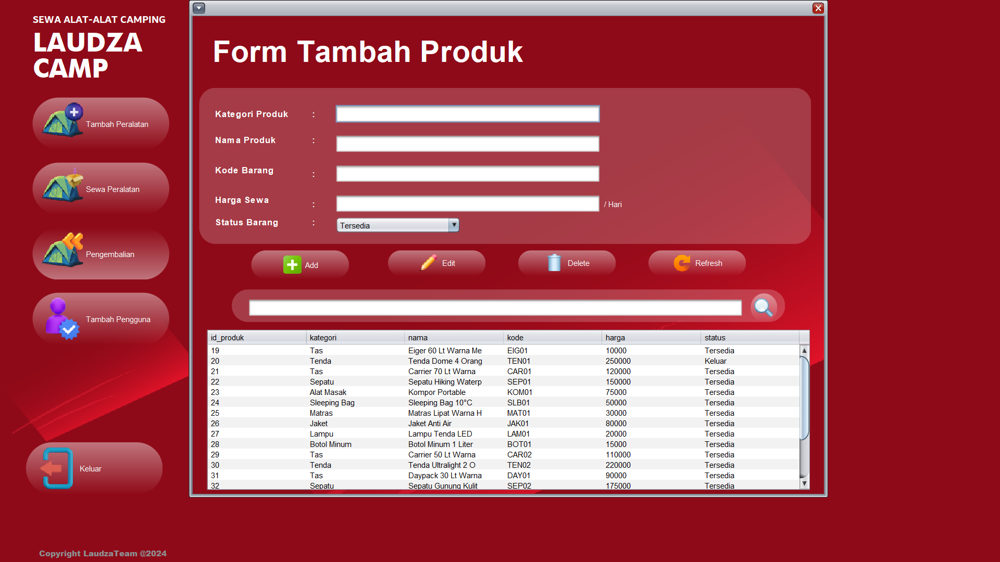

# 🏕️ Si Rental Camping: Java Application



Welcome to **Si Rental Camping**! 🎉 This repository houses a comprehensive Java application designed for managing camping equipment rentals. Built with **Ant** and developed in **NetBeans**, our app streamlines the process of renting and managing camping gear, ensuring both efficiency and user satisfaction.

## Features ✨
- **User-Friendly Interface**: An intuitive GUI that makes navigation and operations a breeze.
- **Inventory Management**: Easily add, update, and track camping equipment in real-time.
- **Booking System**: Seamlessly handle rental bookings, returns, and extend rental periods.
- **Customer Management**: Keep detailed records of customers, including their rental history.
- **Reports & Analytics**: Generate insightful reports to track performance and make data-driven decisions.

## Tech Stack 💻
- **Java**: The core programming language for robust and cross-platform compatibility.
- **Ant**: For automated build processes, ensuring smooth and efficient development cycles.
- **NetBeans**: An integrated development environment (IDE) that supports advanced features and simplifies coding.

## Getting Started 🚀
1. **Clone the Repository**: 
    ```sh
    git clone [https://github.com/username/si-rental-camping.git](https://github.com/AlfeusMartinus/si-rental-camping.git)
    ```
2. **Open in NetBeans**: Import the project to your NetBeans IDE.
3. **Build with Ant**: Use the built-in Ant scripts to compile and run the application.
4. **Explore the Features**: Start managing your camping rentals with ease!

## Contributing 🤝
We welcome contributions! Whether you're fixing bugs, adding new features, or improving documentation, your input is valuable. Check out our [Contributing Guide](CONTRIBUTING.md) to get started.

## License 📜
This project is licensed under the MIT License - see the [LICENSE](LICENSE) file for details.

---

Enjoy a hassle-free camping rental experience with **Si Rental Camping**! 🏕️🌟

For any inquiries or support, feel free to open an issue or contact us at support@si-rental-camping.com.

Happy Camping! 🏞️
